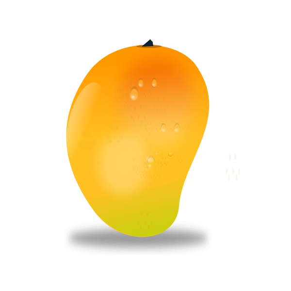

<p align="center">
	
<p>

# mango.php

A tiny php templating framework. ~400 bytes gzipped

## Features
 * Basic interpolation: 
  ```{{=value}}```
 * Unclean interpolation: 
  ```{{%unsafe_value}}```
 * Variable expansion: 
  ```{{=User.account.number}}```
 * If..else: 
  ```{{value}} <<markup>> {{:value}} <<alternate markup>> {{/value}}```
 * If falsy: 
  ```{{!value}} <<markup>> {{/!value}}```
 * Iteration: 
  ```{{@object_value}} {{=_key}}:{{=_val}} {{/@object_value}}```
 
 - Supports multi-line templates (no need to remove newlines)
 - Use and render the same template multiple times with different data

## Demo

```php
$template = new Mango("<div>Hello {{=name}}</div>");
echo $template->parse(array('name' => 'Mango!'));
```

